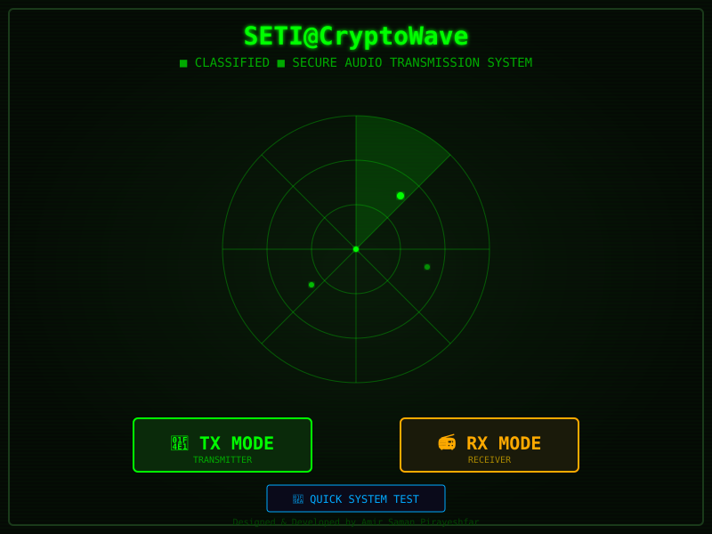
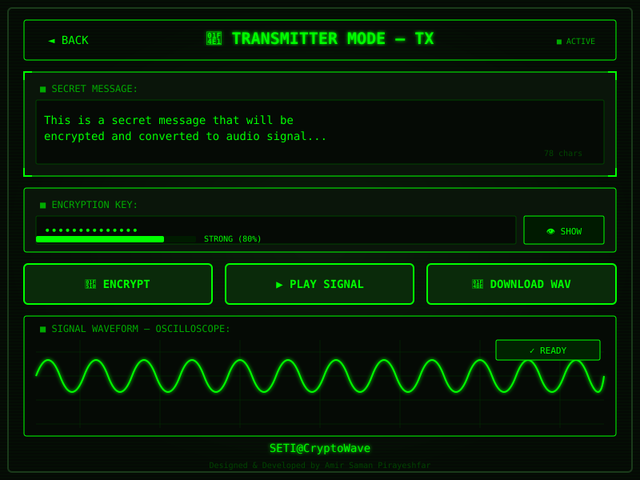
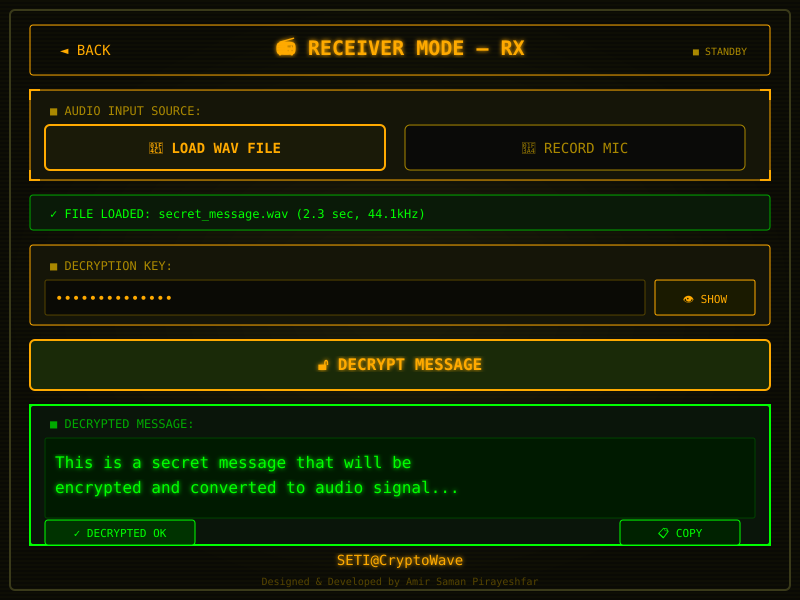

# 🎖️ SETI@CryptoWave

<div align="center">


**Military-Grade Audio Steganography System**

*Hide encrypted messages inside audio signals using FSK modulation*

[Features](#-features) • [Screenshots](#-screenshots) • [How It Works](#-how-it-works) • [Educational Purpose](#-educational-purpose)

</div>

---

## 📡 Overview

**SETI@CryptoWave** is an educational demonstration of how encrypted data can be transmitted through audio signals, inspired by WWII-era military communication equipment. The interface mimics vintage radar screens and oscilloscopes with phosphor-green displays.

> ⚠️ **EDUCATIONAL USE ONLY** - This project is designed to teach concepts of cryptography, digital signal processing, and audio steganography to students and enthusiasts.

---

## ✨ Features

### 🔐 Security
| Feature | Description |
|---------|-------------|
| **AES-256-GCM** | Military-grade encryption algorithm |
| **PBKDF2** | 100,000 iterations for key derivation |
| **Random Salt** | 16-byte unique salt per encryption |
| **Random IV** | 12-byte initialization vector |

### 📻 Audio Transmission
| Feature | Description |
|---------|-------------|
| **FSK Modulation** | Frequency Shift Keying (1200Hz / 2400Hz) |
| **Preamble Sync** | 32-bit synchronization pattern |
| **8-bit Checksum** | Data integrity verification |
| **WAV Export** | 44.1kHz, 16-bit audio files |

### 🎨 Retro Military UI
- CRT phosphor-green display effect
- Rotating radar animation
- Real-time oscilloscope waveform
- Scan lines overlay
- Vintage terminal aesthetics

---

## 📸 Screenshots

### Mission Control (Main Screen)


*Radar display with mode selection - TX (Transmitter) or RX (Receiver)*

### TX Mode - Transmitter


*Encrypt your message and convert to audio signal*

### RX Mode - Receiver  


*Load audio file or record from microphone, then decrypt*

---

## 🔬 How It Works

```
┌─────────────────────────────────────────────────────────────────┐
│                        TRANSMISSION (TX)                         │
├─────────────────────────────────────────────────────────────────┤
│                                                                   │
│   "Hello"  ──►  AES-256-GCM  ──►  FSK Modulation  ──►  Audio    │
│   (Text)       (Encrypted)        (1200/2400 Hz)      (WAV)     │
│                                                                   │
└─────────────────────────────────────────────────────────────────┘

┌─────────────────────────────────────────────────────────────────┐
│                        RECEPTION (RX)                            │
├─────────────────────────────────────────────────────────────────┤
│                                                                   │
│   Audio  ──►  FSK Demodulation  ──►  AES-256-GCM  ──►  "Hello"  │
│   (WAV)       (Frequency Analysis)    (Decrypted)      (Text)   │
│                                                                   │
└─────────────────────────────────────────────────────────────────┘
```

### Technical Details:

1. **Encryption**: Message is encrypted using AES-256-GCM with a password-derived key
2. **Encoding**: Encrypted bytes are prefixed with magic bytes, length, and checksum
3. **Modulation**: Each bit is converted to a tone (0=1200Hz, 1=2400Hz) for 20ms
4. **Transmission**: Audio can be played through speakers or saved as WAV file
5. **Reception**: Audio is analyzed using Goertzel algorithm to detect frequencies
6. **Decryption**: Extracted bytes are decrypted using the same password

---

## 📚 Educational Purpose

This project teaches:

- **Cryptography**: How AES encryption works with key derivation
- **Digital Signal Processing**: Frequency modulation and demodulation
- **Audio Engineering**: WAV file format and audio generation
- **Steganography**: Hiding data in audio signals
- **History**: WWII-era communication techniques

### Learning Resources

If you're interested in these topics:

- [AES Encryption Explained](https://en.wikipedia.org/wiki/Advanced_Encryption_Standard)
- [Frequency Shift Keying](https://en.wikipedia.org/wiki/Frequency-shift_keying)
- [Goertzel Algorithm](https://en.wikipedia.org/wiki/Goertzel_algorithm)
- [Web Crypto API](https://developer.mozilla.org/en-US/docs/Web/API/Web_Crypto_API)

---

## ⚖️ License & Disclaimer

```
MIT License - Educational Use

Copyright (c) 2024 Amir Saman Pirayeshfar

This software is provided for EDUCATIONAL PURPOSES ONLY.

The author is NOT responsible for any misuse of this software.
Users are responsible for complying with all applicable laws
in their jurisdiction.

This project demonstrates cryptographic and signal processing
concepts and should be used only for learning purposes.
```

---

## 🚫 Responsible Use

This tool is designed for:
- ✅ Learning cryptography concepts
- ✅ Understanding digital signal processing
- ✅ Educational demonstrations
- ✅ Personal experimentation

**NOT** intended for:
- ❌ Illegal communications
- ❌ Evading law enforcement
- ❌ Any malicious purposes

---

## 👨‍💻 Author

<div align="center">

**Designed & Developed by Amir Saman Pirayeshfar**

*Inspiring the next generation of cryptographers and engineers*

---

<sub>If you found this educational, please ⭐ the repository!</sub>

</div>
